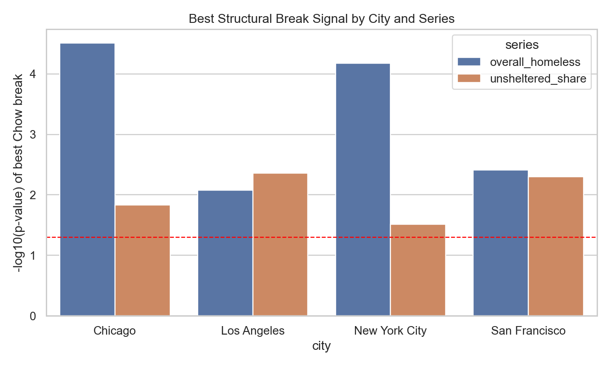
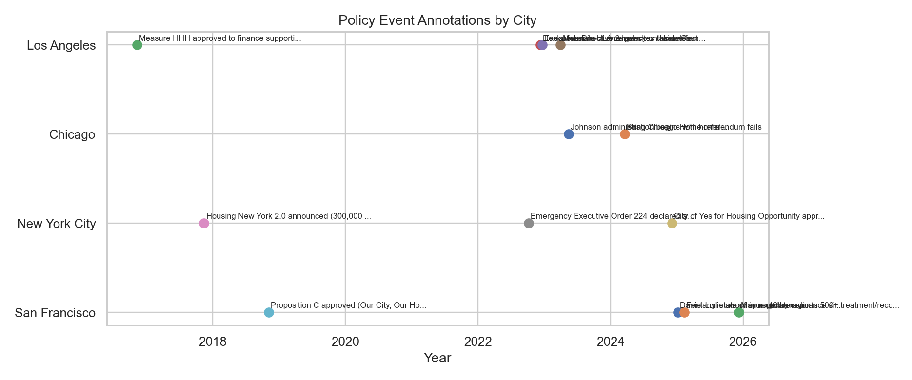
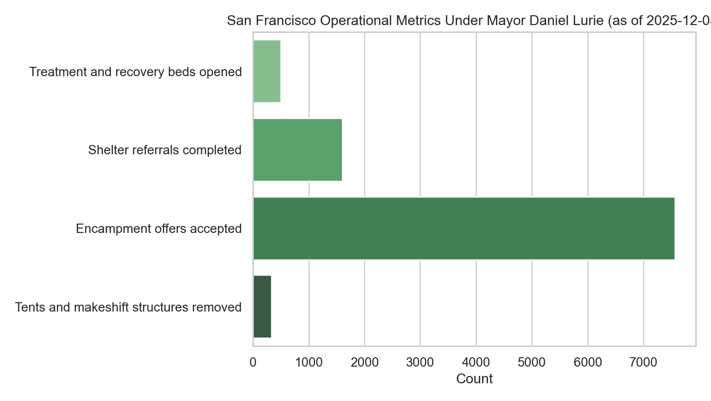

# Executive Summary: Homelessness and Housing (SF, NYC, Chicago, Los Angeles)

## TL;DR
- PIT homelessness rose in all four cities (2011->2024), with the largest growth in Chicago and NYC.
- Phase 2 modeling indicates lagged rent pressure aligns with higher homelessness in this panel, while structural breaks around 2020-2021 are the strongest empirical signal.
- Policy-event timing supports interpretation that shelter-system/inflow regime shifts were major near-term drivers, especially in NYC and Chicago.
- Daniel Lurie now included for SF: official 2025 operational metrics show expansion activity, but no PIT year yet under his administration.

## Data/Method (quick)
- HUD PIT 2011-2024 + ZORI 2015-2026 + NYC daily shelter + policy-event annotations.
- Lagged FE regressions, sensitivity checks, Chow break tests.

## Key Visuals

