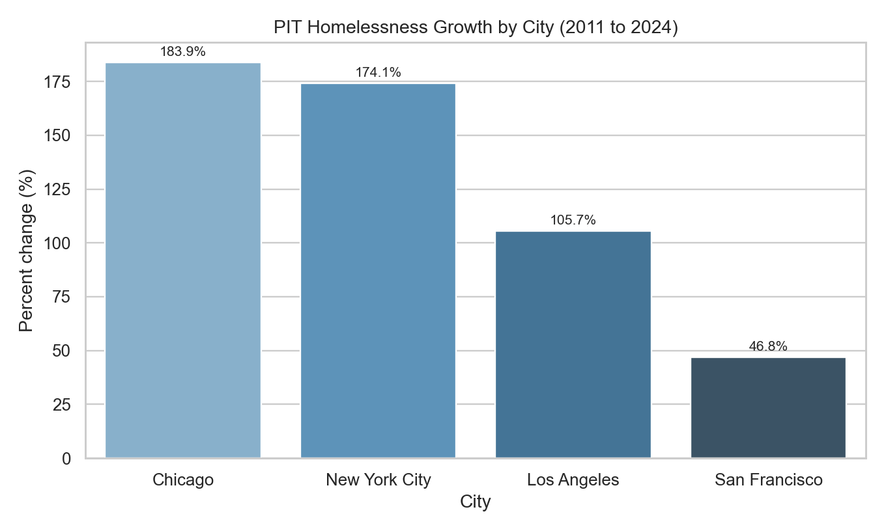
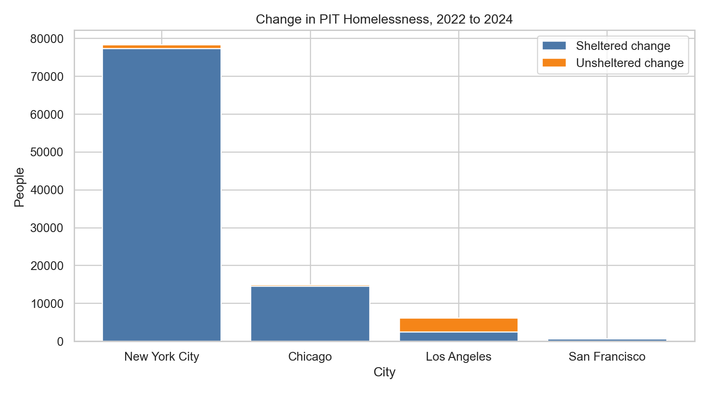

# Executive Summary: Homelessness and Housing (SF, NYC, Chicago, Los Angeles)

## TL;DR
- PIT homelessness rose in all four cities from 2011 to 2024, with largest gains in Chicago and NYC.
- Recent growth in NYC/Chicago is primarily sheltered-count expansion; Los Angeles growth includes both sheltered and unsheltered.
- Rent pressure rose materially in every city (2015->2026).
- 2026 comparable annual PIT is pending; NYC operational data is nearly flat YTD vs 2025.

## Data and Method
- HUD PIT CoC annual counts (2011-2024), Zillow ZORI metro rent index (2015-2026), NYC daily shelter census (to 2026-02-18).
- Mayor-period slicing, city trend comparison, and 2022->2024 sheltered/unsheltered decomposition.

## Core Findings
- Chicago: 183.9% PIT change (2011->2024), unsheltered-share delta -17.3 pp.
- New York City: 174.1% PIT change (2011->2024), unsheltered-share delta -2.0 pp.
- Los Angeles: 105.7% PIT change (2011->2024), unsheltered-share delta 18.3 pp.
- San Francisco: 46.8% PIT change (2011->2024), unsheltered-share delta -7.2 pp.

## Decision-Relevant Interpretation
- Prioritize shelter system throughput metrics where growth is shelter-driven (NYC, Chicago).
- In Los Angeles and San Francisco, maintain unsheltered-focused interventions with geographic targeting.
- Treat rent pressure as a structural risk variable, not a standalone near-term predictor.

