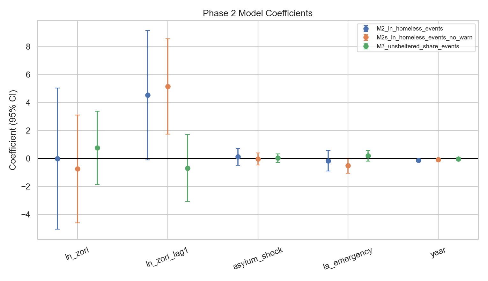

# Homelessness and Housing: 4-City Deep Dive (Phase 2)
## SF | NYC | Chicago | Los Angeles
---
## TL;DR
- Long-run growth in all four cities.
- Break tests point to 2020-2021 regime shifts.
- Policy annotations explain likely channels.
- SF Daniel Lurie period now included with 2025 operational data.
---
## Long-run trends

---
## Composition and unsheltered dynamics

---
## Phase 2 model evidence

---
## Policy timeline annotations

---
## San Francisco: Daniel Lurie (2025)

---
## Interpretation
- Rent pressure appears as a lagged structural factor in panel models.
- 2020-2021 breaks indicate system-level shifts beyond rent alone.
- Recent NYC/Chicago changes are shelter-system heavy.
- LA and SF show different unsheltered dynamics and policy levers.
---
## Sources
- [HUD PIT/AHAR](https://www.huduser.gov/portal/datasets/ahar.html)
- [HUD PIT 2024 page](https://www.huduser.gov/portal/datasets/ahar/2024-ahar-part-1-pit-estimates-of-homelessness-in-the-us.html)
- [NYC DHS Daily Shelter Census](https://data.cityofnewyork.us/d/k46n-sa2m)
- [Zillow ZORI data](https://www.zillow.com/research/data/)
- [SF Our City Our Home](https://www.sf.gov/information/our-city-our-home-oversight-committee)
- [SF Lurie inauguration](https://www.sf.gov/information--mayoral-inauguration-and-public-activities)
- [SF Lurie emergency ordinance](https://www.sf.gov/mayor-lurie-signs-fentanyl-state-of-emergency-ordinance-announces-plan-for-247-police-friendly-stabilization-center)
- [SF Lurie year-one update](https://www.sf.gov/news/mayor-daniel-lurie-delivers-significant-progress-addressing-city-challenges-and-leading-san)
- [NYC Housing New York 2.0](https://www.nyc.gov/office-of-the-mayor/news/722-17/de-blasio-administration-announces-housing-new-york-2-0-three-quarter-million-new-yorkers#/0)
- [NYC EO 224](https://www.nyc.gov/mayors-office/news/2022/10/emergency-executive-order-224)
- [NYC City of Yes passage](https://www.nyc.gov/mayors-office/news/2025/12/most-pro-housing-administration-in-city-history--mayor-adams--ci)
- [LA Measure HHH](https://housing2.lacity.org/residents/measure-hhh)