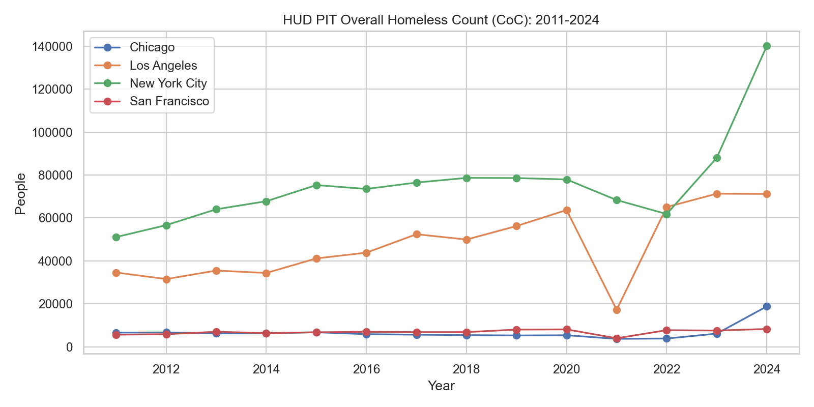
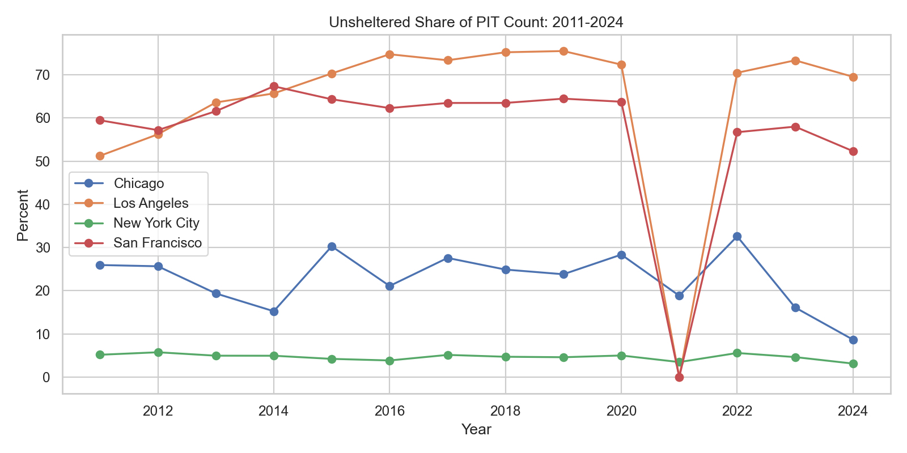
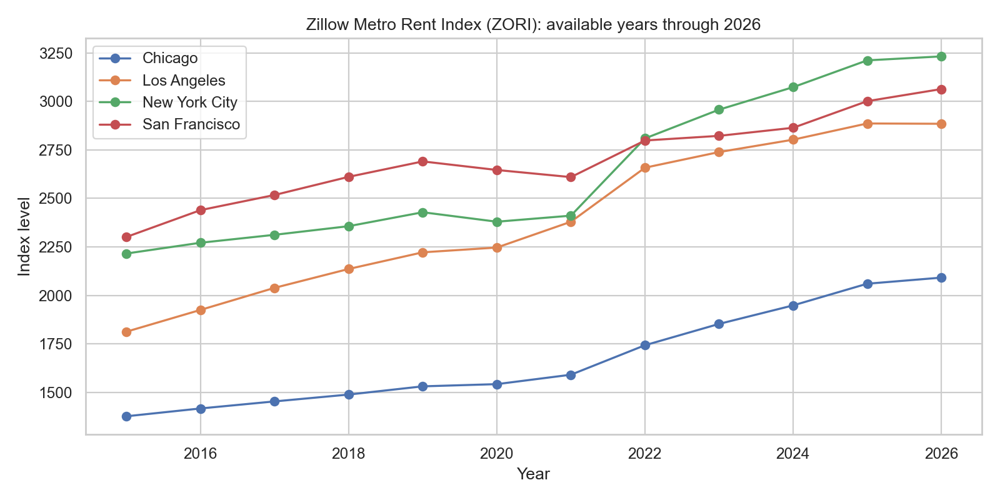
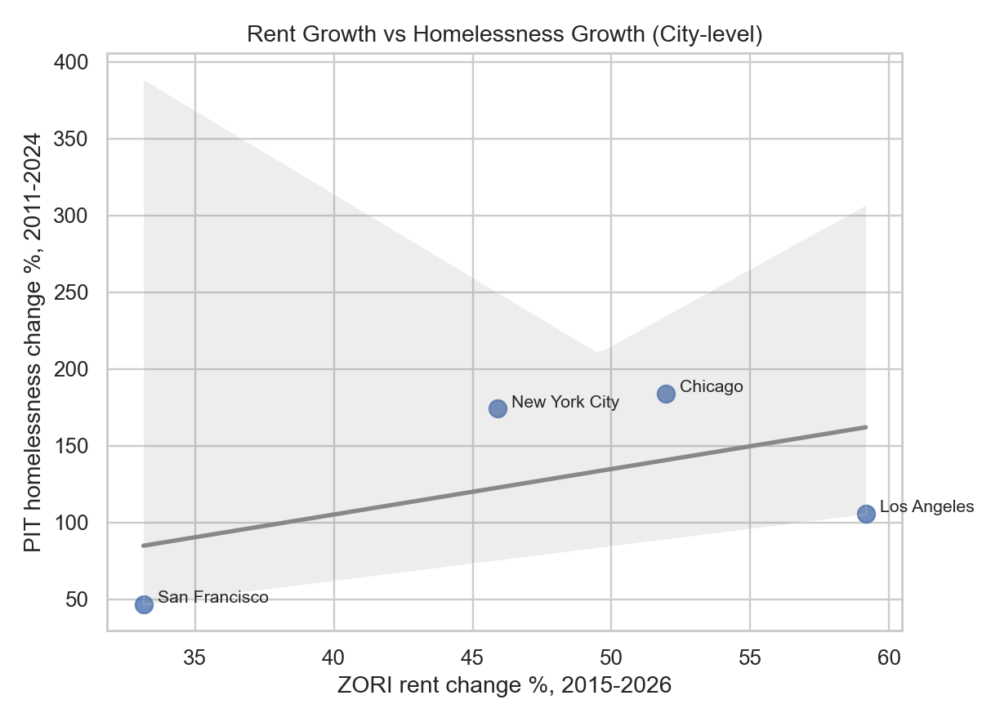
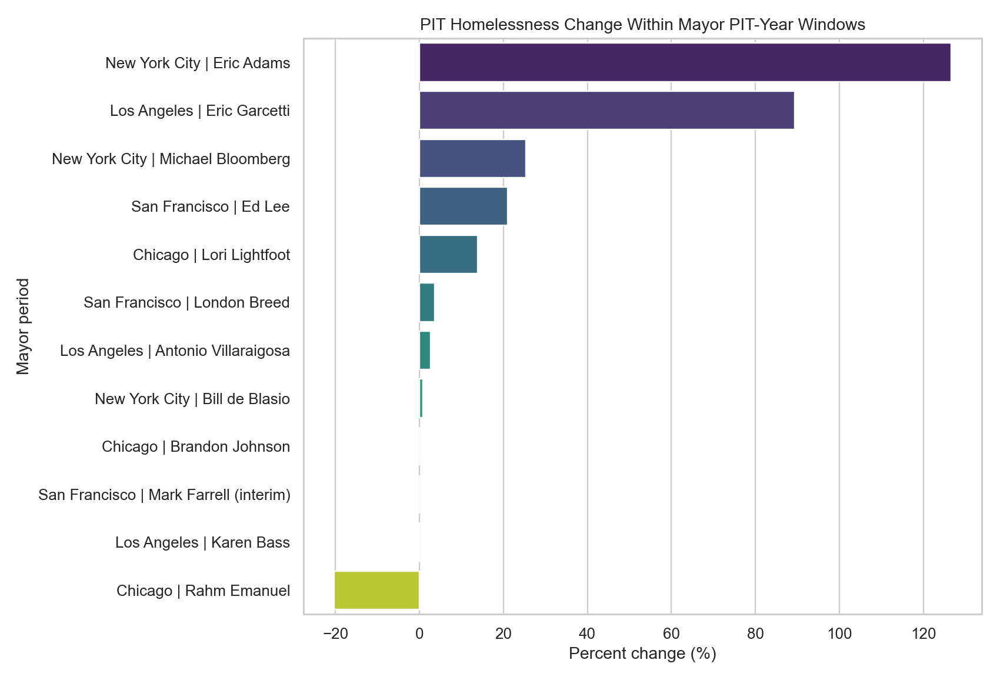

# Metro Homelessness and Housing Patterns (2011-2026)

## TL;DR
- Homelessness increased across all four cities in HUD PIT data from 2011 to 2024: Chicago (+183.9%), NYC (+174.1%), Los Angeles (+105.7%), San Francisco (+46.8%).
- The sharpest 2022->2024 increases in NYC and Chicago were overwhelmingly sheltered-count growth, while Los Angeles saw meaningful growth in both sheltered and unsheltered counts.
- Rent pressure rose strongly in all metros (ZORI 2015->2026): Los Angeles +59.2%, Chicago +52.0%, NYC +45.9%, SF +33.1%.
- 2026 comparable annual PIT is not yet available here; NYC daily census through 2026-02-18 is nearly flat versus same 2025 YTD window (+0.14%).

## Nature of Data, Sources, and Methodology
- `Nature of data`: annual HUD PIT CoC counts (point-in-time, single-night), metro rent index (monthly ZORI rolled to annual averages), and NYC daily operational shelter census for current-year context.
- `Cities and geographies`: SF (CA-501), NYC (NY-600), Chicago (IL-510), Los Angeles (CA-600).
- `Time windows`: PIT 2011-2024, ZORI 2015-2026, NYC daily census 2021-03-01 to 2026-02-18.
- `Methodology`: descriptive time-series analysis, mayor-period segmentation based on PIT years, 2022->2024 decomposition into sheltered vs unsheltered change, and city-level rent-vs-homelessness comparison.
- `Comparability caveat`: PIT methodology differs in some years (for example 2021 sheltered-only/partial unsheltered in select CoCs).

## Key Insights
1. Long-run homelessness growth is substantial in all four cities, with Chicago and NYC showing the largest percentage increases.

2. Unsheltered dynamics diverge: LA unsheltered share rose over 2011-2024, while SF/NYC/Chicago declined.

3. 2022->2024 growth composition differs by city: NYC and Chicago growth was mostly sheltered; LA growth split across both; SF slightly reduced unsheltered while sheltered increased.

4. Rent pressure increased everywhere; correlation with homelessness growth exists at city level but is not one-to-one and is mediated by policy/shelter capacity/inflow dynamics.

5. Mayor-period outcomes show substantial within-city variation across administrations, especially in NYC, Chicago, and Los Angeles.

## Interpretation
- The largest recent PIT increases in NYC and Chicago appear closely tied to sheltered-system expansion/intake pressures, not broad unsheltered spikes.
- Los Angeles remains structurally high with a persistent unsheltered burden and only modest flattening in the latest two PIT years.
- San Francisco shows lower net growth than peers and notable reduction in unsheltered share after 2019.
- Housing costs likely contribute to baseline risk, but institutional and policy channels strongly shape observed counts year to year.

## Detailed Findings Tables
### City summary (2011->2024 PIT)
| city          |   start_homeless |   end_homeless |   pct_change_homeless |   pp_change_unsheltered_share |
|:--------------|-----------------:|---------------:|----------------------:|------------------------------:|
| Chicago       |             6635 |          18836 |               183.888 |                     -17.2784  |
| Los Angeles   |            34622 |          71201 |               105.652 |                      18.295   |
| New York City |            51123 |         140134 |               174.111 |                      -2.04195 |
| San Francisco |             5669 |           8323 |                46.816 |                      -7.15088 |

### 2022->2024 change decomposition
| city          |   change_total_2022_2024 |   change_sheltered_2022_2024 |   change_unsheltered_2022_2024 |
|:--------------|-------------------------:|-----------------------------:|-------------------------------:|
| Chicago       |                    14961 |                        14590 |                            371 |
| Los Angeles   |                     6090 |                         2459 |                           3631 |
| New York City |                    78294 |                        77352 |                            942 |
| San Francisco |                      569 |                          612 |                            -43 |

### Mayor-period summary
| city          | mayor                  |   start_year |   end_year |   start_homeless |   end_homeless |   pct_change_homeless |   pp_change_unsheltered_share |
|:--------------|:-----------------------|-------------:|-----------:|-----------------:|---------------:|----------------------:|------------------------------:|
| Chicago       | Rahm Emanuel           |         2011 |       2019 |             6635 |           5290 |            -20.2713   |                     -2.13475  |
| Chicago       | Lori Lightfoot         |         2020 |       2023 |             5390 |           6139 |             13.8961   |                    -12.2409   |
| Chicago       | Brandon Johnson        |         2024 |       2024 |            18836 |          18836 |              0        |                      0        |
| Los Angeles   | Antonio Villaraigosa   |         2011 |       2013 |            34622 |          35524 |              2.60528  |                     12.3517   |
| Los Angeles   | Eric Garcetti          |         2014 |       2022 |            34393 |          65111 |             89.3147   |                      4.77924  |
| Los Angeles   | Karen Bass             |         2023 |       2024 |            71320 |          71201 |             -0.166854 |                     -3.80714  |
| New York City | Michael Bloomberg      |         2011 |       2013 |            51123 |          64060 |             25.3056   |                     -0.215569 |
| New York City | Bill de Blasio         |         2014 |       2021 |            67810 |          68358 |              0.80814  |                     -1.46454  |
| New York City | Eric Adams             |         2022 |       2024 |            61840 |         140134 |            126.607    |                     -2.44929  |
| San Francisco | Ed Lee                 |         2011 |       2017 |             5669 |           6858 |             20.9737   |                      4.00957  |
| San Francisco | Mark Farrell (interim) |         2018 |       2018 |             6857 |           6857 |              0        |                      0        |
| San Francisco | London Breed           |         2019 |       2024 |             8035 |           8323 |              3.58432  |                    -12.1551   |

### Rent summary (ZORI)
| city          |   rent_start_year |   rent_end_year |   rent_pct_change |
|:--------------|------------------:|----------------:|------------------:|
| Chicago       |              2015 |            2026 |           51.9577 |
| Los Angeles   |              2015 |            2026 |           59.1567 |
| New York City |              2015 |            2026 |           45.8861 |
| San Francisco |              2015 |            2026 |           33.1439 |

### Current-year operational context (NYC)
- Same-window YTD average shelter census: 2025=86247, 2026=86364, change=0.14% (first 49 days).

## Source Links
- [HUD PIT/AHAR](https://www.huduser.gov/portal/datasets/ahar.html)
- [HUD 2007-2024 PIT by CoC workbook](https://www.huduser.gov/portal/datasets/ahar/2024-ahar-part-1-pit-estimates-of-homelessness-in-the-us.html)
- [NYC DHS Daily Shelter Census](https://data.cityofnewyork.us/d/k46n-sa2m)
- [Zillow ZORI Data](https://www.zillow.com/research/data/)
- [San Francisco Mayor Office](https://www.sf.gov/profile--mayor-daniel-lurie)
- [New York City Mayor News](https://www.nyc.gov/office-of-the-mayor/news/)
- [Chicago Mayor Office](https://www.chicago.gov/city/en/depts/mayor.html)
- [Los Angeles Mayor Office](https://mayor.lacity.gov/)