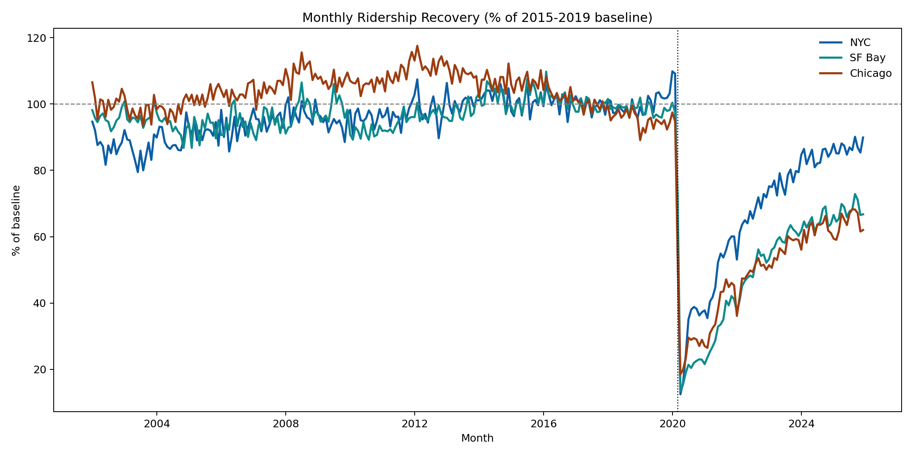
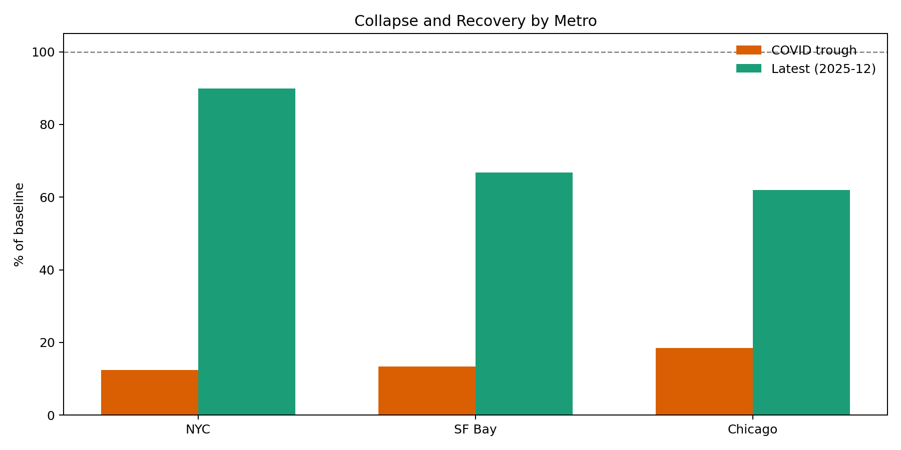
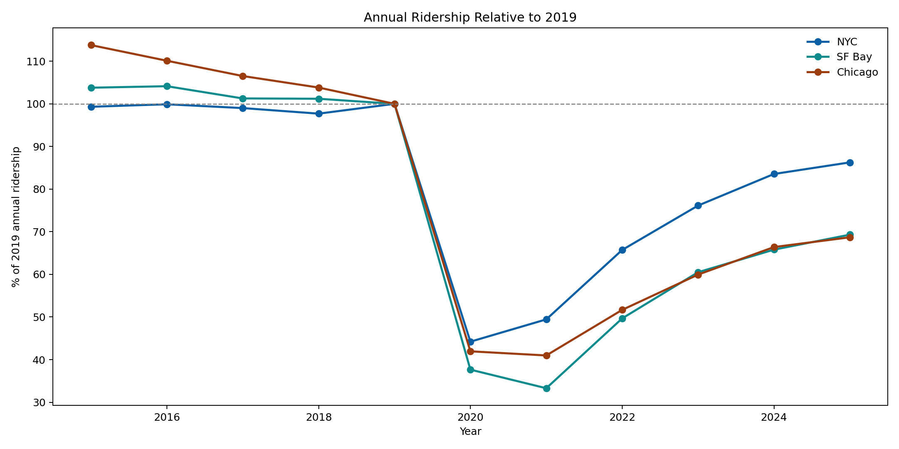
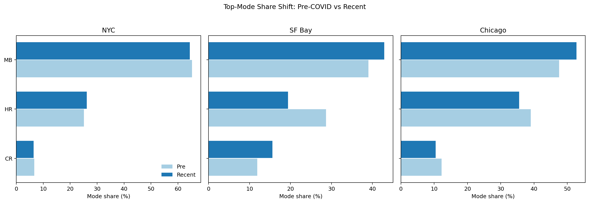
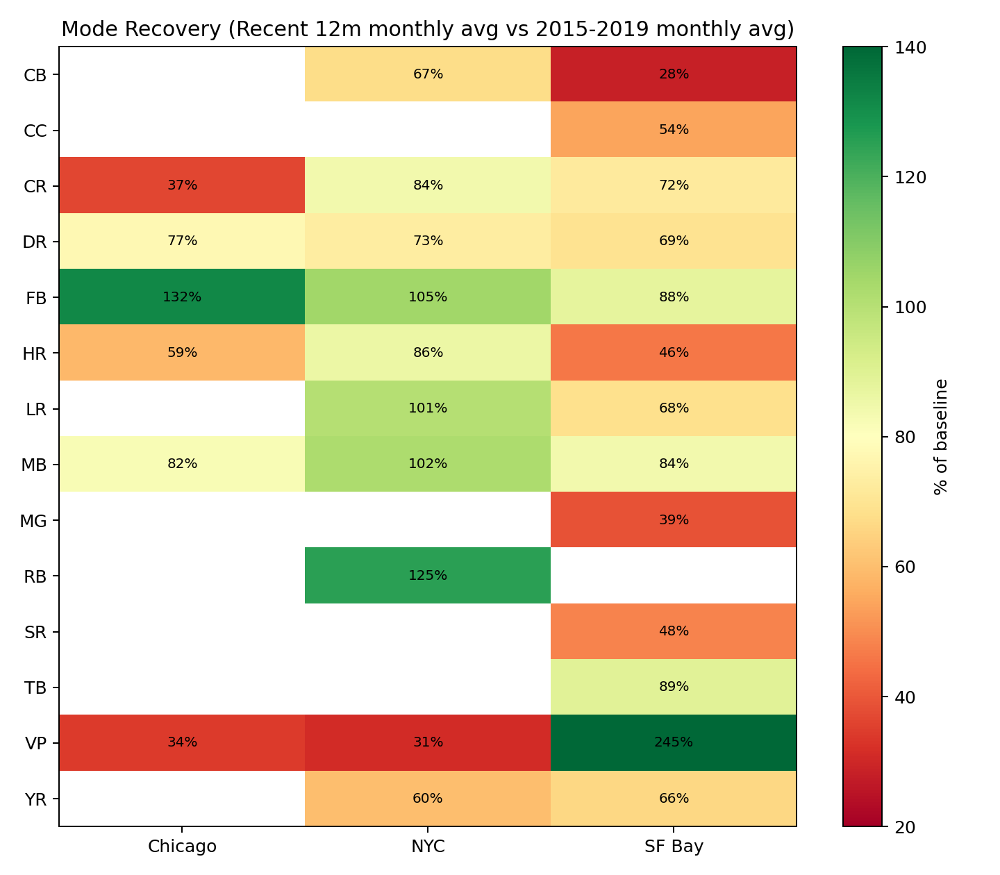
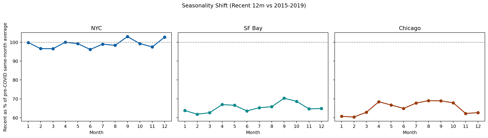

# Transit Ridership Deep Dive (NYC, SF Bay, Chicago)

## TL;DR
- **NYC has recovered far more than SF Bay and Chicago**: 89.9% vs 66.7% and 62.0% of pre-COVID baseline in 2025-12.
- **All three metros collapsed in April 2020**, with troughs around 12.5% (NYC), 13.4% (SF Bay), and 18.5% (Chicago) of baseline.
- **2025 annual levels still trail 2019** in all three metros: NYC 86.3%, SF Bay 69.3%, Chicago 68.7%.
- **Bus/ferry-oriented modes generally recovered better than heavy rail**, especially outside NYC.

## Data, Source, and Methodology
- **Data nature**: Agency-reported, monthly unlinked passenger trips (UPT), mode-level operational ridership.
- **Primary source**: U.S. Department of Transportation / FTA National Transit Database, Complete Monthly Ridership dataset (`8bui-9xvu`).
- **Coverage used**: Metros mapped by UZA label to NYC (`New York--Jersey City--Newark`), SF Bay (`San Francisco--Oakland`), and Chicago (`Chicago, IL--IN`).
- **Time window**: January 2002 through December 2025 in source; analysis baseline uses **January 2015 to December 2019**.
- **Normalization**: For each metro and month-of-year, baseline is the 2015-2019 average for that same month; recovery is current/baseline.
- **Comparative lens**: Metro-level totals, annual trend vs 2019, mode-share shifts, and mode-specific recovery in recent 12 months.

## Key Insights, Interpretations, and Visualizations

### 1) Recovery paths diverged sharply after the shared shock
Interpretation: The initial COVID shock was similar in magnitude, but long-run recovery speed diverged. NYC nearly returned to baseline; SF Bay and Chicago remain structurally lower.

### 2) The trough-to-latest gap is largest outside NYC
Interpretation: NYC rebuilt demand substantially from a deep trough, while SF Bay and Chicago recovered less despite similar shock timing.

### 3) Annual totals confirm persistent post-COVID deficits
Interpretation: Even in 2025, no metro has fully returned to 2019 annual ridership. NYC is closest; SF Bay and Chicago appear to have lower new equilibria.

### 4) Mode mix changed, then partially reverted
Interpretation: During the shock, bus share expanded while rail-heavy commuting fell. Recent mix shows partial normalization, but not full reversion in SF Bay/Chicago.

### 5) Mode-level recovery is uneven within each metro
Interpretation: High-recovery niches (e.g., ferry/other special modes) coexist with still-depressed commuter-heavy modes, indicating segmented demand recovery.

### 6) Seasonality patterns are weaker than pre-COVID
Interpretation: Month-to-month recovery remains below pre-COVID seasonal levels across most of the calendar, especially in SF Bay and Chicago.

## Detailed Findings
- **Latest month (2025-12) recovery vs baseline**:
  - NYC: **89.9%**
  - SF Bay: **66.7%**
  - Chicago: **62.0%**
- **Trough month**: April 2020 for all three metros.
- **Trough depth (% of baseline)**:
  - NYC: **12.5%**
  - SF Bay: **13.4%**
  - Chicago: **18.5%**
- **2025 annual ridership vs 2019**:
  - NYC: **86.3%**
  - SF Bay: **69.3%**
  - Chicago: **68.7%**

## Reproducibility
- Processed data tables are in `data/processed/`.
- This report was generated from those tables by `src/build_report.py`.
